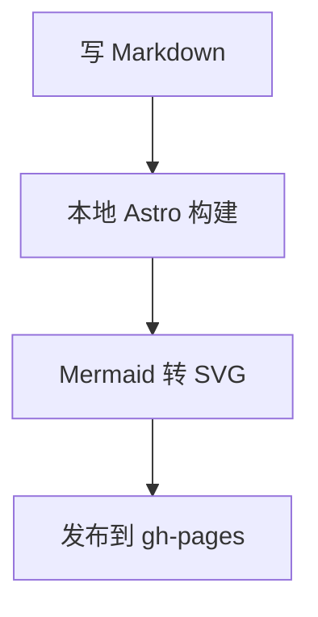

# Markdown 特殊功能渲染测试

这篇文章用于检查当前博客新增的 Markdown 特殊功能渲染效果。发布后可以在页面中直接查看每一类样式是否符合预期。

## Mermaid 流程图

## 提示块

:::note[自定义 Note 标题]
这是 `note` 提示块，适合放普通说明。
:::

:::tip
这是 `tip` 提示块，适合放建议或小技巧。
:::

:::important
这是 `important` 提示块，适合放重要信息。
:::

:::warning
这是 `warning` 提示块，适合放风险提醒。
:::

:::caution
这是 `caution` 提示块，适合放需要谨慎处理的内容。
:::

## 引用块

:::quote
第一行引用内容。

第二行引用内容。
:::

## 行内特殊样式

这是一段包含 !!隐藏文字!! 的句子。

这是一段包含 ==彩虹文字== 的句子。

这是带注音的写法：{西南交通大学}(xī|nán|jiāo|tōng|dà|xué)。

## KaTeX 数学公式

行内公式：$E = mc^2$。

块级公式：

$$
\int_0^1 x^2 dx = \frac{1}{3}
$$
